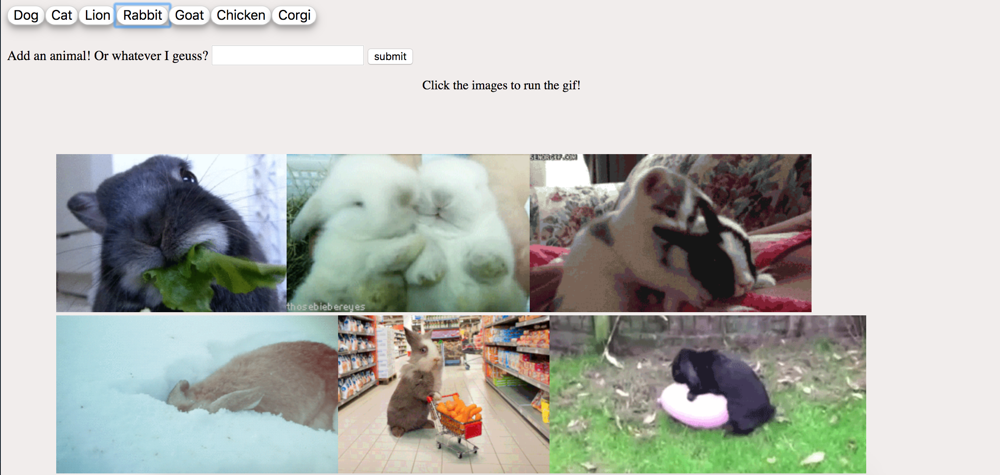
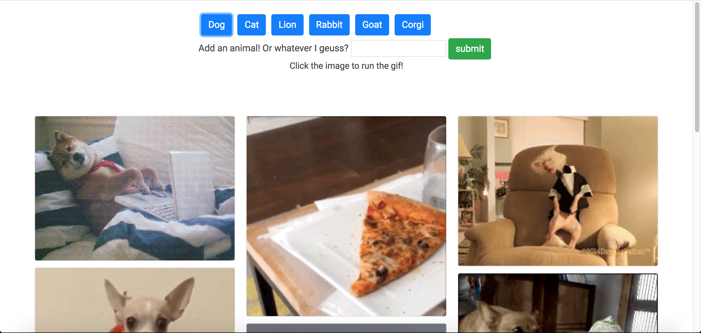

# What was I thinking

last year I was in a coding boot camp where I learned all of my JS skills, today I was digging through old projects and stumbled upon this abomination of design!



Not only is this super ugly, I realized that I wasn't handling the user inputting blank values, so they could endlessly create blank buttons and that's no fun. So first let's fix that, super duper simple all we need is a statement that checks if the value entered is blank or not like this.


```javascript
$("#addAnimal").on("click", function(event) {
  event.preventDefault();
  var animal = $("#animal-input")
    .val()
    .trim();
  //simple 'if' to say if the value is NOT null create btn else alert the user
  if (animal != "") {
    topics.push(animal);
    createButtons();
    $("input[type='text']").val("");
  } else {
    alert("Please enter a value");
  }
});
```

Next, we need to make this look better, the gifs are all jammed against each other and it just looks bad. Nothing a little bootstrap cant fix. I added a `card-columns` class to the gif container and `card` classes to each gif that is created. This gives us a nice clean looking layout and really brings the look together.

I also fixed the buttons at the top giving them some space and better colors. as well as a little CSS here and there for margins on the tops and bottoms.

when it is all said and done my final product looks like this



you can view it live [here][1]

Thanks for reading!!

[1]: https://dlionz.github.io/Giftastic/ "Live"